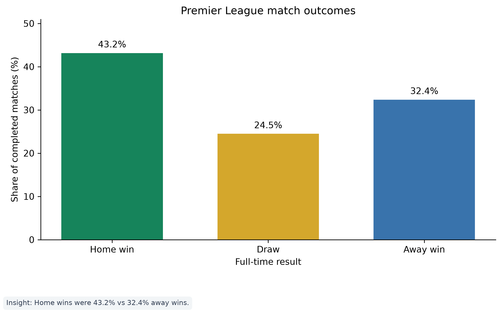
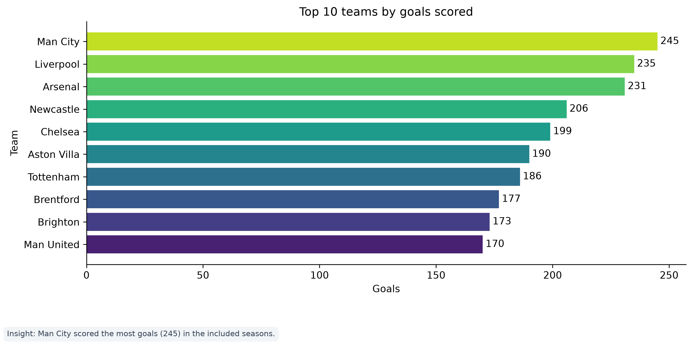
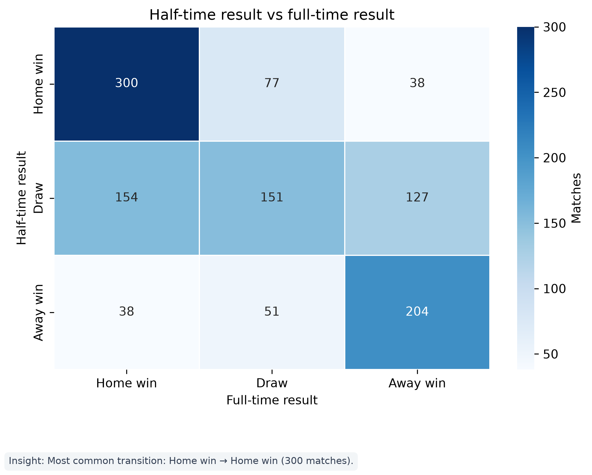
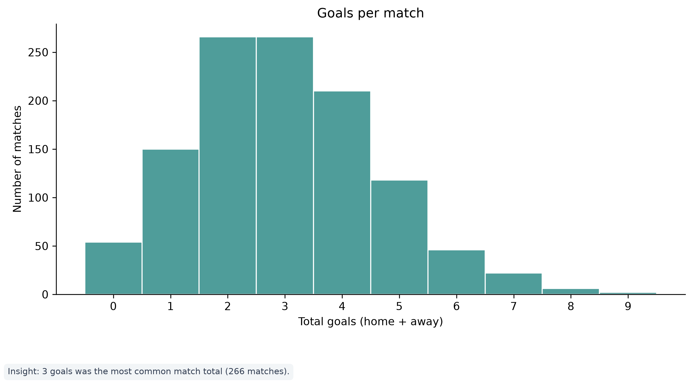
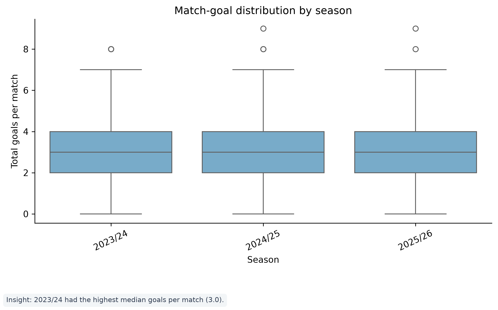
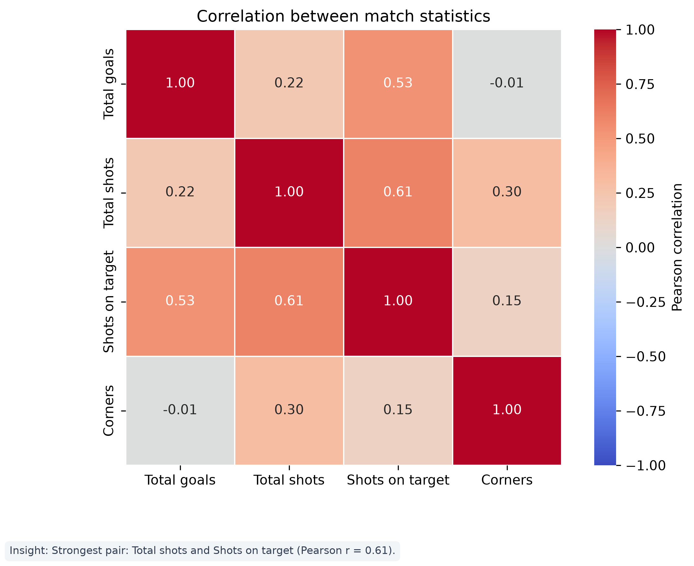
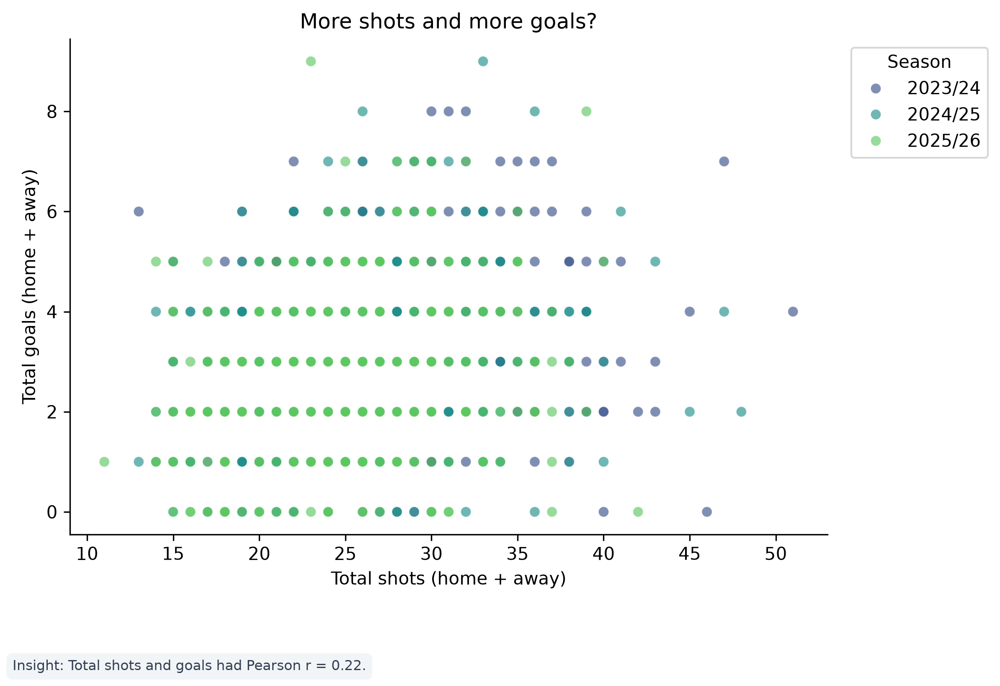
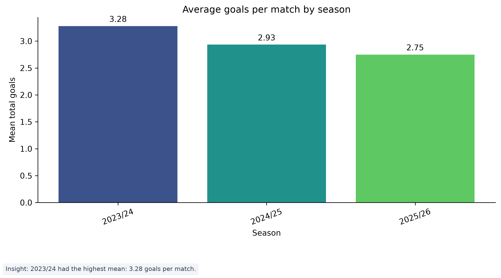

# T13 — Visualization insights

Based on 1,140 completed matches from 2023/24, 2024/25, 2025/26.
Each note describes the values shown in the chart; correlations are associations and do not establish cause.

## RQ1 — Match outcomes

**Evidence-based insight:** Home wins were 43.2% of completed matches, compared with 32.4% away wins (a +10.8 percentage-point difference).

## RQ2 — Team attacking performance

**Evidence-based insight:** Man City scored the most goals across the included seasons: 245 in total.

## RQ3 — Half-time to full-time

**Evidence-based insight:** The most frequent transition was Home win → Home win: 300 matches (26.3%).

## RQ4 — Goal distribution

**Evidence-based insight:** The most common match total was 3 goals, occurring in 266 matches (23.3%).

## RQ4 — Goal spread by season

**Evidence-based insight:** 2023/24 had the highest median total goals per match (3.0).

## RQ5 — Match-statistic correlations

**Evidence-based insight:** The strongest pairwise correlation was between Total shots and Shots on target (Pearson r = 0.61), a positive association.

## RQ5 — Shots and goals

**Evidence-based insight:** Total shots and total goals had a positive Pearson correlation (r = 0.22).

## Season comparison

**Evidence-based insight:** 2023/24 had the highest average, at 3.28 goals per match across 380 completed matches.
